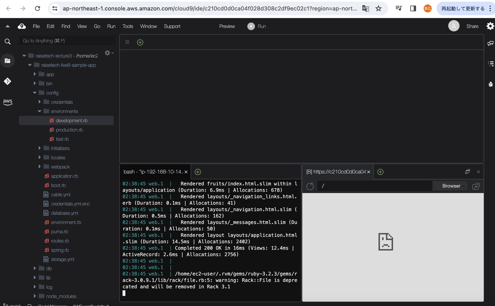
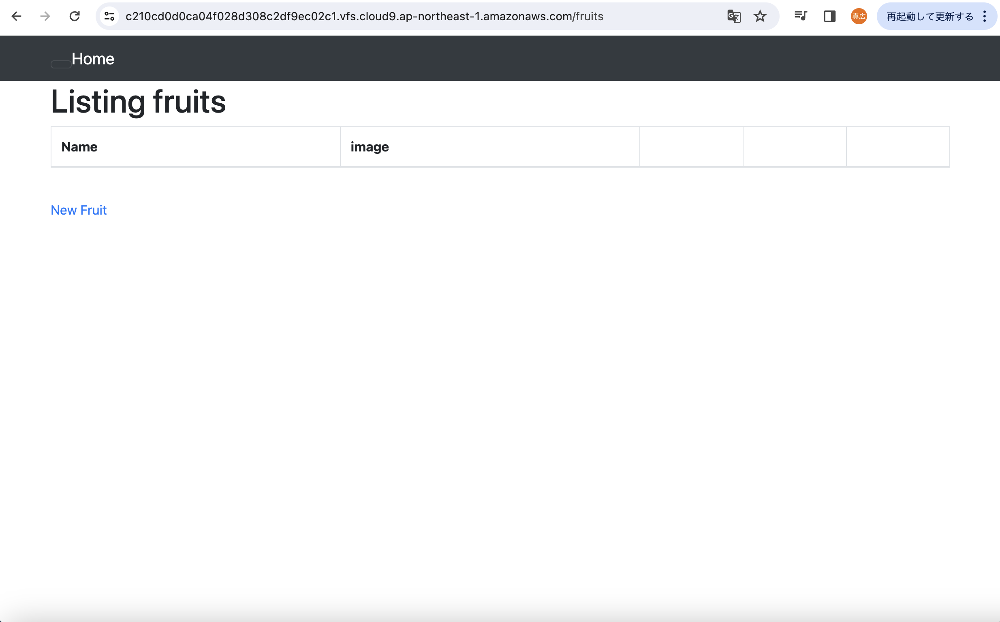
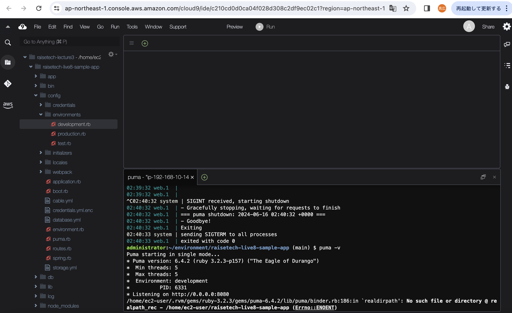
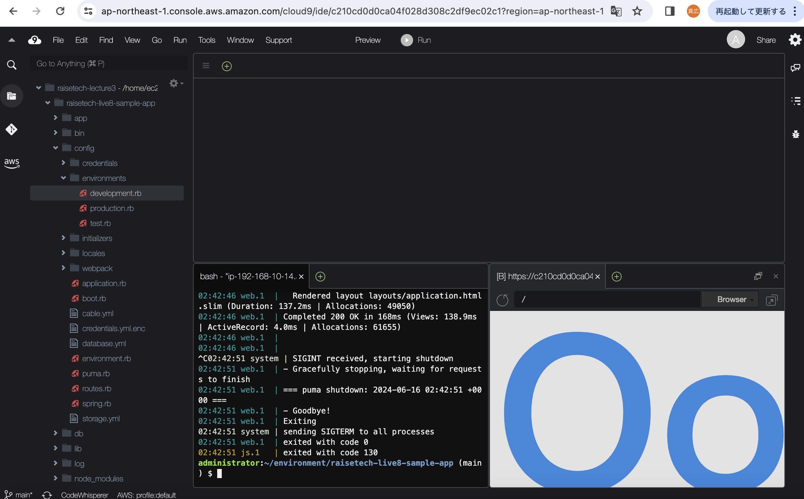
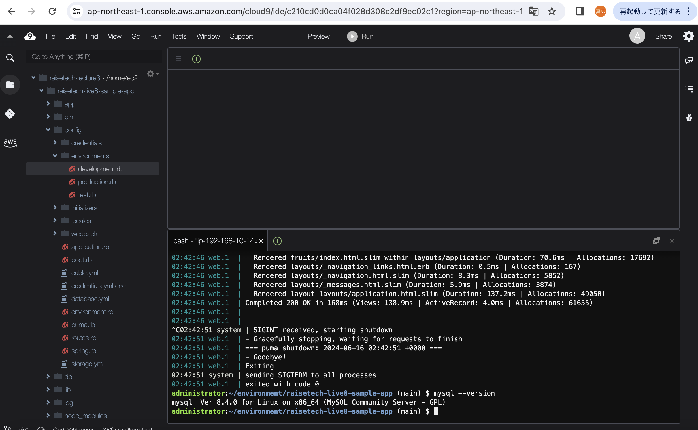
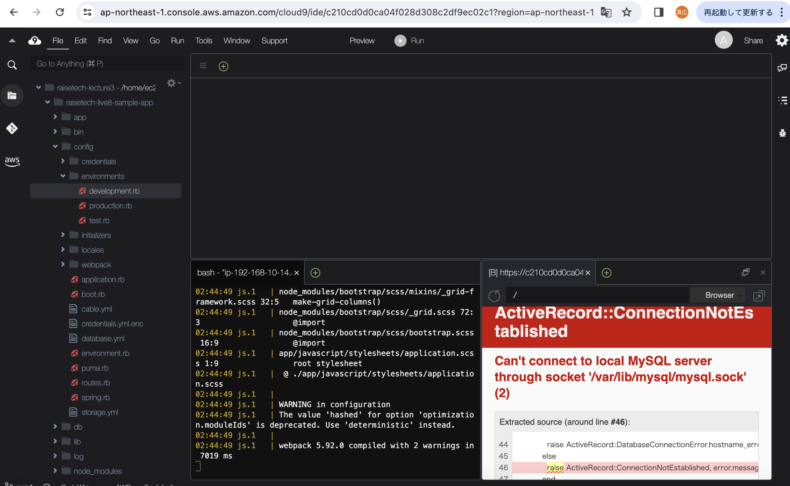

## 第3回課題

### 1.サンプルアプリの起動

  

  ブラウザで起動した時の画面

  

### 2.APサーバーについて

1.APサーバーの名称とバージョンの確認

  puma ver6.4.2

  

2.APサーバーを終了させた時の挙動の確認

  

  APサーバーを終了させた場合は、アクセスが不可能になる。

### 3.DBサーバーについて

1.DBサーバーの名称とバージョンの確認

  mysql Ver 8.4.0

  

2.DBサーバーを終了させた時の挙動の確認

  

  DBサーバーを終了させた場合も、アクセスが不可能になる。

3.Railsの構成管理ツールの名前

Bundler

### 4.今回の課題の学習と感想

- MySQLのダウンロードからブラウザへの表示までトライアンドエラーの繰り返しで非常に大変でした。
何度も心が折れましたが諦めずなんとか形になってよかったです。

- 意外と諦めずにやればなんとかなるのだなと思ったので少し自信がつきました。